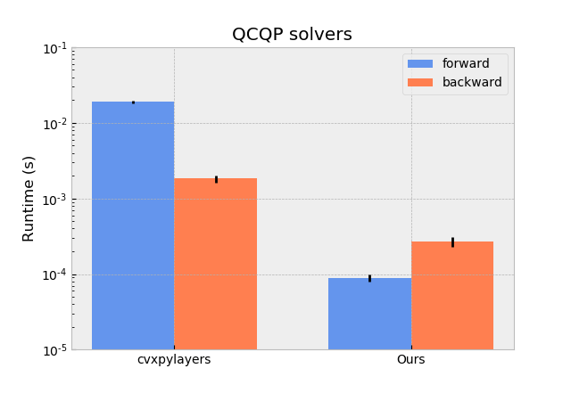

# diffqcqp
Implementations of QP/QCQP solvers using ADMM algorithm and their analytical derivatives. This implementation is used in the paper "Differentiable simulation for physical system identification" (Q. Le Lidec, I. Kalevatykh, I. Laptev, C. Schmid and J. Carpentier) (https://hal.archives-ouvertes.fr/hal-03025616/). 

We propose C++ functions and their python interface (which can easily be integrated into any Automatic Differentiation such as PyTorch or Tensorflow) that allows solving the following QPs/QCQPs:
```
minimize        0.5 x' P x + q' x

subject to      0<= x 
```
and 
```
minimize        0.5 x' P x + q' x

subject to      ||x_(i)|| <= mu(i)*l_n(i) for each contact i 
```


## Installation
The python package can be installed by running:

```
python setup.py install
```

## Usage
Below is a usage example showing how our differentiable solver is used and can be integrated into a learning architecture by taking advantage of PyTorch autodiff tool.
```
import torch
from qcqp import QPFn2

B= 10 #batch size
N = 8 #dimension of the problem

P = torch.rand((B,N),dtype = torch.double)
P = torch.diag_embed(P) #positive semi-definite matrix of the QP objective function
P = torch.nn.parameter.Parameter(P, requires_grad= True)
q = torch.rand((B,N,1),dtype = torch.double) #vector of the QP objective function
q = torch.nn.parameter.Parameter(q, requires_grad= True)


eps = 1e-7 #precision of the solver
warm_start = torch.zeros(q.size()) #vector used to warm-start the QP solver
max_iter = 1000 #maximum iterations for the solver 


qpsolver = QPFn2.apply
optimizer = torch.optim.Adam([P,q])
loss = torch.nn.MSELoss()

l = qpsolver(P,q,warm_start,eps,max_iter)
target = torch.rand(q.size())
L = loss(target,l)

optimizer.zero_grad()
loss.backward()
print(q.gradient) #contains gradient of the loss w.r.t q
optimizer.step()
```

## Experiments
Experiments comparing runtime performances of the solver during forward and backward passes to others differentiable solvers (OptNet: https://arxiv.org/abs/1703.00443 , Cvxpylayers: https://web.stanford.edu/~boyd/papers/diff_dgp.html) can be runned with:
```
python test_script.py
```




## Citing
This work can be cited with:
```
@unpublished{lelidec:hal-03025616,
  TITLE = {{Differentiable simulation for physical system identification}},
  AUTHOR = {Le Lidec, Quentin and Kalevatykh, Igor and Laptev, Ivan and Schmid, Cordelia and Carpentier, Justin},
  URL = {https://hal.archives-ouvertes.fr/hal-03025616},
  NOTE = {working paper or preprint},
  YEAR = {2020},
  MONTH = Nov,
  KEYWORDS = {Contact Modeling ; Simulation and Animation ; Optimization and Optimal Control ; Calibration and Identification},
  PDF = {https://hal.archives-ouvertes.fr/hal-03025616/file/lelidec2020diffsim.pdf},
  HAL_ID = {hal-03025616},
  HAL_VERSION = {v1},
}
```


